<!--
  GitHub profile for Shivam Upadhyay (@dynagi)

  How this page is built
  - Every image in assets/ is a static SVG drawn by scripts/build_assets.py.
  - Numbers are real and public: repository and language data from the GitHub REST API,
    commit totals from the GitHub Search API, and the contribution calendar from
    github.com/users/dynagi/contributions. Nothing is hand-typed.
  - .github/workflows/refresh.yml reruns the script daily using the default GITHUB_TOKEN
    (no extra secrets). If a source is down, the last good value in data/github.json is kept.
  - Regions between START/END markers are regenerated; edit their content in the script.
-->

<!-- ═══════════════════════════ HERO ═══════════════════════════ -->

  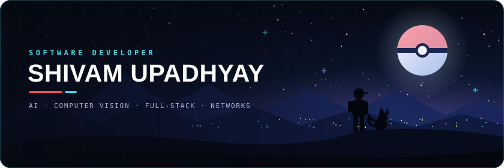

<h1 align="center">Shivam Upadhyay</h1>

  <b>Software developer who teaches machines to see, builds intelligent systems, and turns ideas into real products.</b>

  <a href="https://github.com/dynagi?tab=repositories">GitHub</a> ·
  <a href="https://portfolio-three-nu-3ula1bfeni.vercel.app/">Portfolio</a> ·
  <a href="https://www.linkedin.com/in/shivam24upadhyay/">LinkedIn</a> ·
  <a href="mailto:shivam24upadhyay@gmail.com">Email</a>

  <a href="#about"><code>ABOUT</code></a>
  <a href="#stats"><code>STATS</code></a>
  <a href="#projects"><code>PROJECTS</code></a>
  <a href="#stack"><code>STACK</code></a>
  <a href="#mission"><code>MISSION</code></a>
  <a href="#journey"><code>JOURNEY</code></a>
  <a href="#connect"><code>CONNECT</code></a>

<!-- ═══════════════════ PROFILE + SUMMARY ═══════════════════ -->

  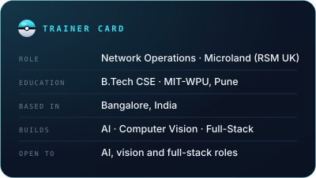
  <a href="https://github.com/dynagi">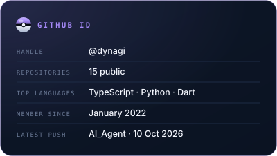</a>

I build AI-powered applications, computer-vision systems and the full-stack products around them — recently a finance co-pilot, an exam-paper security platform and a community app. My day job is network operations at Microland, where I'm building depth in infrastructure, cloud and system administration.

<!-- ═══════════════════ GITHUB STATISTICS ═══════════════════ -->

<h2 align="center">GitHub Statistics</h2>

  
  
  
  

  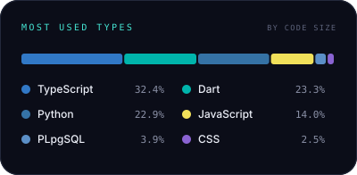
  <a href="https://github.com/dynagi?tab=repositories">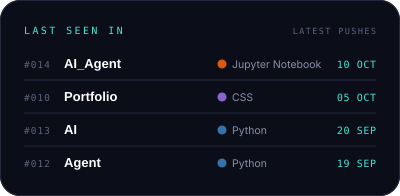</a>

<!-- ═══════════════════ CONTRIBUTION ACTIVITY ═══════════════════ -->
<h3 align="center">Contribution Activity</h3>

  <a href="https://github.com/dynagi">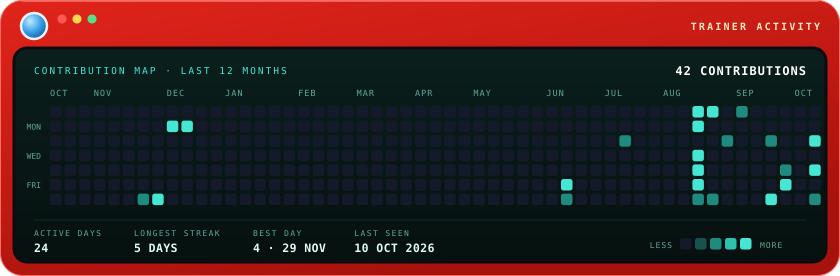</a>

My public GitHub contribution calendar, redrawn daily from live data.

<!-- ═══════════════════ FEATURED REPOSITORIES ═══════════════════ -->

<h2 align="center">Featured Repositories</h2>

Four builds worth opening first. Each card links to its repository.

<!-- FEATURED:START (generated by scripts/build_assets.py) -->

  <a href="https://github.com/dynagi/AI">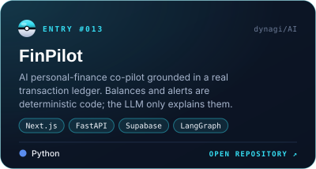</a>
  <a href="https://github.com/dynagi/App">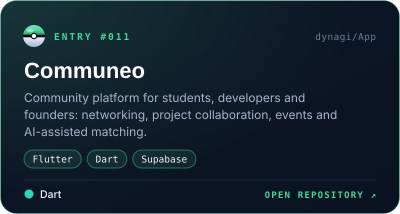</a>
  <a href="https://github.com/dynagi/Final-Exam">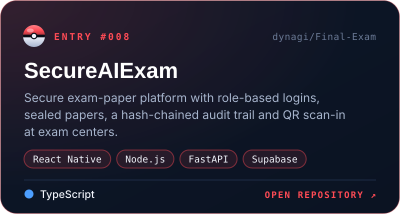</a>
  <a href="https://github.com/dynagi/AI_Agent">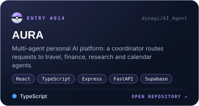</a>

<!-- FEATURED:END -->

<!-- ═══════════════════ PINNED PROJECTS ═══════════════════ -->
<h3>Pinned Projects</h3>

<!-- PINNED:START (generated by scripts/build_assets.py) -->
- **[Tennis Analysis](https://github.com/dynagi/Tennis-Analysis)** — Player, ball and court tracking from match video with YOLO and CNNs. `Python`
- **[PathFinder](https://github.com/dynagi/Path-finder)** — Assistive navigation for visually impaired users using YOLO and MiDaS depth. `Python`
- **[Secure RAG](https://github.com/dynagi/Secure-RAG)** — Document Q&A with semantic chunking, ChromaDB and a LangGraph retry loop. `Python`
- **[Portfolio](https://github.com/dynagi/Portfolio)** — Pokédex-inspired developer portfolio built with Next.js and GSAP. `CSS` · [live](https://portfolio-gigacbum.vercel.app)
<!-- PINNED:END -->

<b>Full repository index</b> — every public repository, newest first

 

<!-- INDEX:START (generated by scripts/build_assets.py) -->
| No. | Repository | About | Language | Updated |
|:--|:--|:--|:--|:--|
| 014 | [AI_Agent](https://github.com/dynagi/AI_Agent) | **AURA** — Multi-agent personal AI platform: a coordinator routes requests to travel, finance, research and calendar agents. | TypeScript | Oct 2026 |
| 010 | [Portfolio](https://github.com/dynagi/Portfolio) | Pokédex-inspired developer portfolio built with Next.js and GSAP | CSS | Oct 2026 |
| 013 | [AI](https://github.com/dynagi/AI) | **FinPilot** — AI personal-finance co-pilot grounded in a real transaction ledger. Balances and alerts are deterministic code; the LLM only explains them. | Python | Sep 2026 |
| 012 | [Agent](https://github.com/dynagi/Agent) | Earlier iteration of FinPilot | Python | Sep 2026 |
| 011 | [App](https://github.com/dynagi/App) | **Communeo** — Community platform for students, developers and founders: networking, project collaboration, events and AI-assisted matching. | Dart | Sep 2026 |
| 009 | [Tarun-Birthday](https://github.com/dynagi/Tarun-Birthday) | Animated birthday celebration site built with React and Vite | JavaScript | Aug 2026 |
| 008 | [Final-Exam](https://github.com/dynagi/Final-Exam) | **SecureAIExam** — Secure exam-paper platform with role-based logins, sealed papers, a hash-chained audit trail and QR scan-in at exam centers. | TypeScript | Aug 2026 |
| 006 | [New-Exam](https://github.com/dynagi/New-Exam) | Earlier iteration of SecureAIExam | TypeScript | Aug 2026 |
| 007 | [Secure-RAG](https://github.com/dynagi/Secure-RAG) | **Secure RAG** — Document Q&A with semantic chunking, ChromaDB and a LangGraph retry loop | Python | Jul 2026 |
| 005 | [Tennis-Analysis](https://github.com/dynagi/Tennis-Analysis) | **Tennis Analysis** — Player, ball and court tracking from match video with YOLO and CNNs | Python | Dec 2025 |
| 002 | [Path-finder](https://github.com/dynagi/Path-finder) | **PathFinder** — Assistive navigation for visually impaired users using YOLO and MiDaS depth | Python | Dec 2025 |
| 004 | [OneCart](https://github.com/dynagi/OneCart) | **OneCART** — MERN e-commerce store with live chat, voice and video | JavaScript | Nov 2025 |
| 003 | [StockMarket](https://github.com/dynagi/StockMarket) | Warehouse and stock management app with a FastAPI backend | JavaScript | Nov 2025 |
| 001 | [ecom](https://github.com/dynagi/ecom) | MERN e-commerce app built while following a course | JavaScript | Aug 2024 |
<!-- INDEX:END -->

<!-- ═══════════════════════ TECH STACK ═══════════════════════ -->

<h2 align="center">Tech Stack</h2>

What the projects above are built with.

  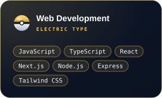
  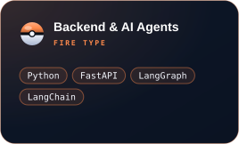
  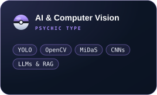
  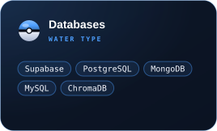
  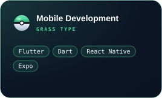
  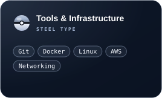

<!-- ═════════════════════ CURRENT MISSION ═════════════════════ -->

<h2 align="center">Current Mission</h2>

- 🟢 **Building** [FinPilot](https://github.com/dynagi/AI) — an AI co-pilot for personal-finance decisions.
- 🟢 **Building** [Communeo](https://github.com/dynagi/App) — a community app for students, developers and founders.
- 🟢 **Developing** [AURA](https://github.com/dynagi/AI_Agent) — a multi-agent personal AI platform.
- 🔵 **Learning** network infrastructure, cloud and system administration through my work at Microland.
- 🔵 **Sharpening** AI, computer vision and full-stack engineering skills.

<!-- ═══════════════ EDUCATION AND CAREER JOURNEY ═══════════════ -->

<h2 align="center">Education &amp; Career</h2>

  
  
  

<!-- ═══════════ ACHIEVEMENTS AND CERTIFICATIONS ═══════════ -->
<h3 align="center">Achievements &amp; Certifications</h3>

  
  
  
  

<!-- ═══════════════════════ LET'S CONNECT ═══════════════════════ -->

<h2 align="center">Let's Connect</h2>

  Open to roles and collaborations in AI, computer vision and full-stack engineering. 
  Email is the fastest way to reach me: <a href="mailto:shivam24upadhyay@gmail.com">shivam24upadhyay@gmail.com</a>

  
  
  
  
  

Catch ideas. Build better. Ship meaningful software.

