<!--
  Trainer's Pokédex — GitHub profile for Shivam Upadhyay (@dynagi)
  Shares its design system with the portfolio: https://portfolio-three-nu-3ula1bfeni.vercel.app/
  Panels in assets/ are generated by scripts/build_assets.py — edit the data there, not the SVGs.
-->

<!-- ═══════════════════════════ HERO ═══════════════════════════ -->

  <a href="https://portfolio-three-nu-3ula1bfeni.vercel.app/"></a>
  <a href="#trainer">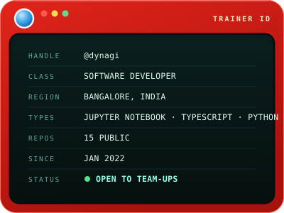</a>

  <b>Software developer who teaches machines to see</b> — then ships the product around them.

  <a href="#trainer">Profile</a> ·
  <a href="#types">Types</a> ·
  <a href="#mission">Mission</a> ·
  <a href="#pokedex">Pokédex</a> ·
  <a href="#journey">Journey</a> ·
  <a href="#badges">Badges</a> ·
  <a href="#contact"><b>Connect</b></a>

<!-- ═════════════════════ TRAINER PROFILE ═════════════════════ -->

<code>POKÉDEX ENTRY · TRAINER PROFILE</code>

<h2 align="center">Trainer Profile</h2>

> **SHIVAM, the Vision Developer.** Usually spotted where a trained model has to survive contact with the real world. Its favoured moves are detection, tracking and depth estimation; when a model needs a home it builds the web app too. Known to turn research into working tools — a navigation aid for blind users, a tennis match analyzer, a heart-risk predictor — two of which became published papers. Currently roaming cloud and network infrastructure at Microland.

<!-- ═══════════════════════ TRAINER STATS ═══════════════════════ -->

<code>TRAINER STATS</code>

  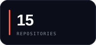
  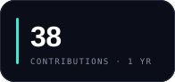
  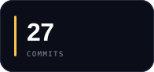
  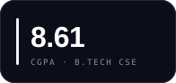

<!-- ════════════════════ TYPE CHART / TECH ════════════════════ -->

<code>TYPE CHART · TECHNOLOGIES</code>

<h2 align="center">Type Chart</h2>

A triple-type trainer. Bars show how battle-tested each move is.

  
  
  

<!-- ═════════════════════ CURRENT MISSION ═════════════════════ -->

<code>MISSION STATUS · ACTIVE</code>

<h2 align="center">Current Mission</h2>

- **Training** — Network Engineer at **Microland**, working through infrastructure, cloud and system administration.
- **Building** — [**FinPilot**](https://github.com/dynagi/AI): an AI agent for personal-finance decisions that reasons over your own ledger · `Next.js` `FastAPI` `Supabase` `LangGraph`
- **Building** — [**Communeo**](https://github.com/dynagi/App): a community app connecting students, developers and founders · `Flutter` `Supabase`
- **Seeking** — teams and roles in AI, computer vision and full-stack engineering.

<!-- ═══════════════ FIELD ENTRIES / PROJECT POKÉDEX ═══════════════ -->

<code>FIELD ENTRIES · PROJECT POKÉDEX</code>

<h2 align="center">Project Pokédex</h2>

Six entries logged so far. Each capsule opens its repository.

  <a href="https://github.com/dynagi/Path-finder"></a>
  <a href="https://github.com/dynagi/Tennis-Analysis"></a>
  <a href="https://portfolio-three-nu-3ula1bfeni.vercel.app/#projects"></a>
  <a href="https://github.com/dynagi/OneCart"></a>
  <a href="https://github.com/dynagi/Final-Exam"></a>
  <a href="https://github.com/dynagi/Secure-RAG"></a>

<b>Scan remaining entries</b> — No. 003 · No. 004 · No. 006

 

**No. 003 · Heart Risk Measure** — `MACHINE LEARNING`
- **Field notes:** predicts heart-disease likelihood from a 919-patient dataset; several models trained and compared head to head, and the results published as a research paper.
- **Moves:** `Python` `scikit-learn` `Pandas`
- **Habitat:** no public repository — [see the portfolio entry](https://portfolio-three-nu-3ula1bfeni.vercel.app/#projects)

**No. 004 · OneCART** — `FULL-STACK`
- **Field notes:** an e-commerce store where buyers and sellers can talk live — chat, voice and video are built into the shopping flow.
- **Moves:** `React` `Node.js` `Express` `MongoDB` `ZEGOCLOUD`
- **Habitat:** [dynagi/OneCart](https://github.com/dynagi/OneCart)

**No. 006 · Secure RAG** — `AI / LLM`
- **Field notes:** ask questions of your own PDFs and notes. Documents are chunked by meaning into ChromaDB; a LangGraph loop retrieves, grades relevance, rewrites the query if the first pass misses, then answers with citations.
- **Moves:** `LangGraph` `ChromaDB` `LangChain` `Streamlit` `Python`
- **Habitat:** [dynagi/Secure-RAG](https://github.com/dynagi/Secure-RAG)

<!-- ═════════════════════ RARE ENCOUNTERS ═════════════════════ -->

<code>★ RARE ENCOUNTERS</code>

<h2 align="center">Rare Encounters</h2>

  <a href="https://github.com/dynagi/Path-finder">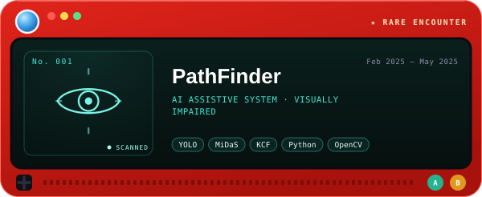</a>

  Spots obstacles with YOLO, judges their distance from a single camera with MiDaS, 
  and speaks directions aloud so a visually impaired user can move with confidence. 
  <b>Why it matters:</b> vision research turned into guidance someone can actually walk with. 
  <a href="https://github.com/dynagi/Path-finder"><b>[ VIEW REPOSITORY ]</b></a>

 

  <a href="https://github.com/dynagi/Tennis-Analysis">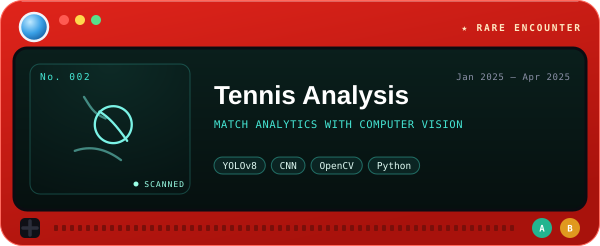</a>

  Follows both players and the ball through match footage, maps the court from keypoints, 
  and reports speed, positioning and court coverage. 
  <b>Why it matters:</b> the method held up well enough to be published as a research paper (Jun 2025). 
  <a href="https://github.com/dynagi/Tennis-Analysis"><b>[ VIEW REPOSITORY ]</b></a>

 

  <a href="https://github.com/dynagi/Final-Exam">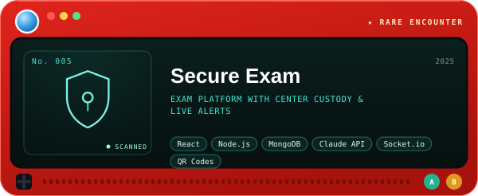</a>

  Runs a question paper's whole life: authoring and PDF import, QR-stamped printing, 
  slot scheduling, and invigilators scanning each copy in at the exam center. 
  <b>Why it matters:</b> any copy still unscanned about 20 minutes before its slot triggers a critical alert. 
  <a href="https://github.com/dynagi/Final-Exam"><b>[ VIEW REPOSITORY ]</b></a>

<!-- ═════════════════════ TRAINER JOURNEY ═════════════════════ -->

<code>ROUTE MAP</code>

<h2 align="center">Trainer Journey</h2>

  
  
  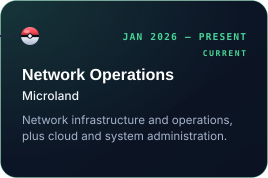

<!-- ═════════════════════ TRAINER BADGES ═════════════════════ -->

<code>BADGE CASE</code>

<h2 align="center">Trainer Badges</h2>

  <a href="https://portfolio-three-nu-3ula1bfeni.vercel.app/#badges">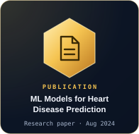</a>
  
  <a href="https://portfolio-three-nu-3ula1bfeni.vercel.app/#badges">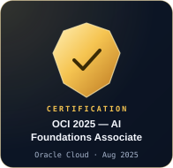</a>
  <a href="https://portfolio-three-nu-3ula1bfeni.vercel.app/#badges"></a>

<!-- ═════════════════════ TRAINER ACTIVITY ═════════════════════ -->

<code>LIVE FEED</code>

<h2 align="center">Trainer Activity</h2>

  

<!-- ═══════════════════ COMMUNICATION CHANNEL ═══════════════════ -->

<code>POKÉDEX COMMUNICATION CHANNEL</code>

<h2 align="center">Open a Channel</h2>

  Got a model that needs shipping, or a product that needs eyes? Signal's open. 
  Email gets the quickest reply — <a href="mailto:shivam24upadhyay@gmail.com">shivam24upadhyay@gmail.com</a>

  
  <a href="https://www.linkedin.com/in/shivam24upadhyay/">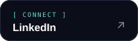</a>
  <a href="https://portfolio-three-nu-3ula1bfeni.vercel.app/">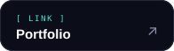</a>
  

END OF ENTRY · Same trainer, full Pokédex at the <a href="https://portfolio-three-nu-3ula1bfeni.vercel.app/">portfolio</a>.

