<!--
  Trainer Command Center — GitHub profile for Shivam Upadhyay (@dynagi)

  Every panel in assets/ is drawn by scripts/build_assets.py from live GitHub data
  and refreshed daily by .github/workflows/refresh.yml. Edit the script's config,
  not the SVGs. The repository index below is regenerated between its markers.
-->

<!-- ═══════════════════════════ HERO ═══════════════════════════ -->

  
  

  <b>Software developer who teaches machines to see</b> — then ships the product around them. 
  <a href="https://portfolio-three-nu-3ula1bfeni.vercel.app/">Portfolio</a> ·
  <a href="https://www.linkedin.com/in/shivam24upadhyay/">LinkedIn</a> ·
  <a href="mailto:shivam24upadhyay@gmail.com">Email</a>

  <a href="#profile"><code>[ PROFILE ]</code></a>
  <a href="#activity"><code>[ ACTIVITY ]</code></a>
  <a href="#repositories"><code>[ REPOSITORIES ]</code></a>
  <a href="#stack"><code>[ STACK ]</code></a>
  <a href="#mission"><code>[ MISSION ]</code></a>
  <a href="#journey"><code>[ JOURNEY ]</code></a>
  <a href="#contact"><code>[ CONTACT ]</code></a>

<!-- ═════════════════ TRAINER PROFILE + STATISTICS ═════════════════ -->

<code>TRAINER PROFILE</code>

<h2 align="center">Who's behind the handle</h2>

> I build around computer vision and LLMs, and I write the web or mobile app those models end up living in. Lately that means an AI finance agent, an exam-paper security platform and a community app. By day I work on network infrastructure at Microland.

<code>TRAINER STATISTICS · LIVE FROM GITHUB</code>

  
  
  
  

<!-- ═════════════════════ TRAINER ACTIVITY ═════════════════════ -->

<code>TRAINER ACTIVITY</code>

<h2 align="center">Contribution Map</h2>

  

  
  

<!-- ═══════════════ POKÉDEX · REPOSITORY INDEX ═══════════════ -->

<code>POKÉDEX · REPOSITORY INDEX</code>

<h2 align="center">Repository Index</h2>

Every public repository, numbered in the order it was caught. Each entry opens its repo.

<code>★ RARE ENCOUNTERS</code> The three builds I'd show first.

<!-- REPOS:START (generated by scripts/build_assets.py) -->

  <a href="https://github.com/dynagi/AI">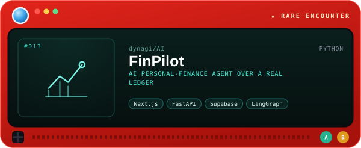</a>

  Deterministic finance, LLM only for language: balances and alerts are exact code, and the agent can only call read-only tools on your own data. 
  <a href="https://github.com/dynagi/AI"><b>[ OPEN REPOSITORY ]</b></a>

  <a href="https://github.com/dynagi/App">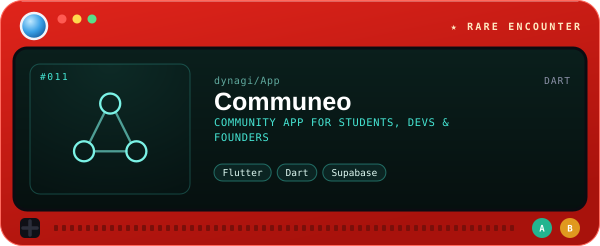</a>

  One app for networking, hackathon team formation, jobs, mentorship and events, with AI-assisted matching. 
  <a href="https://github.com/dynagi/App"><b>[ OPEN REPOSITORY ]</b></a>

  <a href="https://github.com/dynagi/Final-Exam">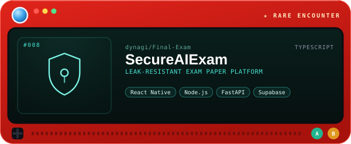</a>

  Follows every question paper from sealing to the exam hall, with a hash-chained audit trail and QR scan-in at each center. 
  <a href="https://github.com/dynagi/Final-Exam"><b>[ OPEN REPOSITORY ]</b></a>

<code>⚡ ACTIVE BUILDS</code> Pushed to in the last 90 days.

  <a href="https://github.com/dynagi/Portfolio"></a>
  <a href="https://github.com/dynagi/AI_Agent"></a>

LIVE: <a href="https://portfolio-gigacbum.vercel.app">Portfolio ↗</a>

<code>◈ EXPERIMENT LAB</code> AI, computer-vision and side experiments.

  <a href="https://github.com/dynagi/Tarun-Birthday"></a>
  <a href="https://github.com/dynagi/Secure-RAG"></a>
  <a href="https://github.com/dynagi/Tennis-Analysis"></a>
  <a href="https://github.com/dynagi/Path-finder"></a>

<b>ARCHIVED ENTRIES</b> — 5 entries. Older builds and earlier iterations.

 

  <a href="https://github.com/dynagi/Agent"></a>
  <a href="https://github.com/dynagi/New-Exam"></a>
  <a href="https://github.com/dynagi/OneCart"></a>
  <a href="https://github.com/dynagi/StockMarket"></a>
  <a href="https://github.com/dynagi/ecom"></a>

<!-- REPOS:END -->

<!-- ════════════════════ TYPE CHART · TECH STACK ════════════════════ -->

<code>TYPE CHART · TECH STACK</code>

<h2 align="center">Type Chart</h2>

What the repositories above are actually built with.

  
  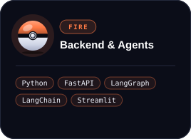
  
  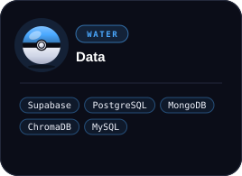
  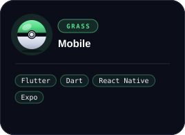
  

<!-- ═════════════════════ CURRENT MISSION ═════════════════════ -->

<code>MISSION STATUS · ACTIVE</code>

<h2 align="center">Current Mission</h2>

- **Building** — [FinPilot](https://github.com/dynagi/AI): an AI agent for personal-finance decisions, grounded in a real ledger.
- **Building** — [Communeo](https://github.com/dynagi/App): a Flutter community app for students, developers and founders.
- **Exploring** — [AURA](https://github.com/dynagi/AI_Agent): a web client for a multi-agent AI assistant.
- **Training** — network infrastructure, cloud and system administration at Microland.
- **Seeking** — teams and roles in AI, computer vision and full-stack engineering.

<!-- ═════════════════════ TRAINER JOURNEY ═════════════════════ -->

<code>ROUTE MAP</code>

<h2 align="center">Trainer Journey</h2>

  
  
  

<!-- ═════════════════════ TRAINER BADGES ═════════════════════ -->

<code>TRAINER BADGES</code>

  
  
  
  

<!-- ═══════════════════ POKÉDEX COMMUNICATION ═══════════════════ -->

<code>POKÉDEX COMMUNICATION</code>

<h2 align="center">Open a Channel</h2>

  Got a model that needs shipping, or a product that needs eyes? Email gets the quickest reply: 
  <a href="mailto:shivam24upadhyay@gmail.com">shivam24upadhyay@gmail.com</a>

  
  
  
  

<!-- ═══════════════════════════ FOOTER ═══════════════════════════ -->

  <code>END OF ENTRY</code> 
  The journey continues. Gotta build 'em all.

